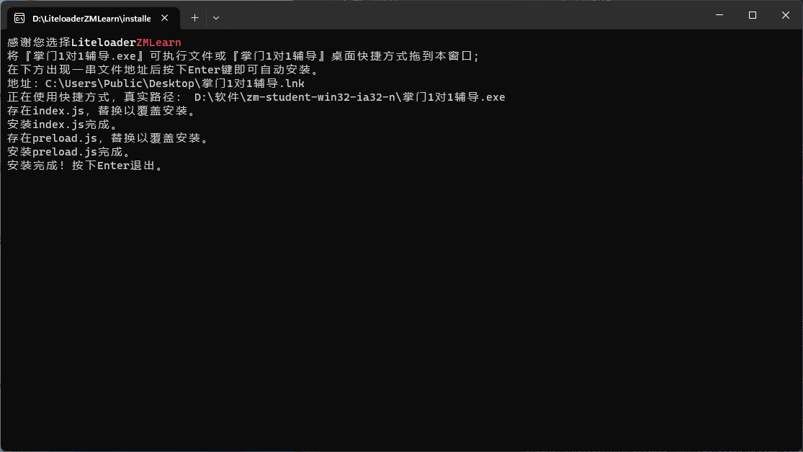

# LiteloaderZMLearn
### 适用于掌门1对1客户端的插件加载器
**加载你的专属插件，优化你的上课体验！**

>[!WARNING]
>
> 不要轻易安装来历不明的插件（特别是非开源、混淆、文件夹内含有.node后缀的C++模块的）！这可能造成个人信息泄露！（建议有能力审查插件代码之后再使用除了本加载器作者和您做的插件之外的插件）

---
# 功能
### 独立控制台窗口

将stdout重定向至控制台窗口，插件安装状态、出错问题出处一目了然。

<!--[了解LMainContext.log函数]()-->

### 前后端分离加载插件

使仅前端插件刷新页面即可重载，提高开发效率

### 文件协议支持

通过`plugin://<包名>/路径`格式的URL轻松加载插件资源

---

# 使用教程
### 安装加载器
#### 自动安装（推荐）

##### Step 1:下载Release并解压
建议放在D:\LiteloaderZMLearn这种显眼且有意义下的目录内，方便更新和安装插件
##### Step 2:运行解压出来的目录下的llinstaller.exe，跟随提示的步骤进行安装。
若输出为如图所示（若已安装过，出现“覆盖安装xx”是正常现象，不是错误。）

---
### 安装插件
##### Step 1:打开插件文件夹
<details>
<summary>找不到安装目录或不想翻找？点击查看快捷方法</summary>

##### （1）  在窗口左上角菜单中找到LiteloaderZMLearn选项（如图）

##### （2）  点击“打开插件文件夹”链接（之后会支持从压缩包安装）


</details>

##### Step 2:将插件完整解压到文件夹内
到这一步文件目录结构应类似于下方

```
plugins文件夹
├─插件
│  └─plugin.json
└─插件
   └─plugin.json
```